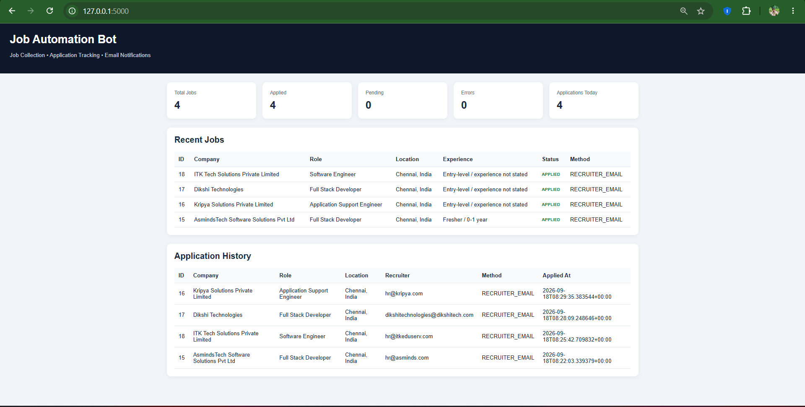

\# JobAutomationBot


An automated job discovery, filtering, application-tracking, and email-notification system built with Python.


\## Overview


JobAutomationBot searches for entry-level IT opportunities, filters them according to configured career preferences, tracks discovered jobs in SQLite, and can automatically send applications through permitted recruiter-email routes.


The system is designed for fresher-level opportunities in:


\* Chennai

\* Hosur

\* Bengaluru / Bangalore


Target roles include Software Engineering, Java Development, Backend Development, Full Stack Development, Technical Support, IT Support, Application Support, QA/Testing, and related entry-level IT roles.


\## Key Features


\* Automated job collection from a public job feed

\* Role-based job filtering

\* Chennai, Hosur, and Bengaluru/Bangalore location filtering

\* Fresher / 0–1 year experience filtering

\* 7-day job freshness filtering

\* Active-job and listing-quality filtering

\* Duplicate-job detection

\* SQLite-based job and application tracking

\* Resume PDF attachment

\* Automated recruiter-email applications

\* Application status tracking

\* Daily application limit

\* Application confirmation emails

\* Daily summary emails

\* Windows Task Scheduler integration

\* Automatic execution when the user logs into Windows

\* Playwright foundation for direct web application forms

\* Safeguards for unknown required fields, login pages, and CAPTCHA detection

\* Local configuration through environment variables


\## Technology Stack


| Technology             | Purpose                             |

| ---------------------- | ----------------------------------- |

| Python                 | Core automation                     |

| Requests               | Job-feed data retrieval             |

| Playwright             | Browser automation                  |

| SQLite                 | Job and application database        |

| Flask                  | Local dashboard                     |

| Gmail SMTP             | Application and notification emails |

| python-dotenv          | Environment configuration           |

| Windows Task Scheduler | Automatic execution                 |

| Git / GitHub           | Version control and project hosting |


\## System Architecture


```text

&#x20;                   ┌─────────────────────┐

&#x20;                   │     Job Sources     │

&#x20;                   └──────────┬──────────┘

&#x20;                              │

&#x20;                              ▼

&#x20;                   ┌─────────────────────┐

&#x20;                   │   Job Collector     │

&#x20;                   │      Python         │

&#x20;                   └──────────┬──────────┘

&#x20;                              │

&#x20;                              ▼

&#x20;                   ┌─────────────────────┐

&#x20;                   │    Job Filters      │

&#x20;                   │ Role / Location /   │

&#x20;                   │ Experience / Age    │

&#x20;                   └──────────┬──────────┘

&#x20;                              │

&#x20;                              ▼

&#x20;                   ┌─────────────────────┐

&#x20;                   │      SQLite DB      │

&#x20;                   │ Jobs + Applications │

&#x20;                   └──────────┬──────────┘

&#x20;                              │

&#x20;                    ┌─────────┴─────────┐

&#x20;                    │                   │

&#x20;                    ▼                   ▼

&#x20;          ┌─────────────────┐   ┌─────────────────┐

&#x20;          │ Application      │   │ Local Dashboard │

&#x20;          │ Engine           │   │     Flask       │

&#x20;          └────────┬────────┘   └─────────────────┘

&#x20;                   │

&#x20;         ┌─────────┴─────────┐

&#x20;         │                   │

&#x20;         ▼                   ▼

&#x20;┌──────────────────┐  ┌──────────────────┐

&#x20;│ Recruiter Email  │  │ Direct Web Form  │

&#x20;│ + Resume         │  │ Playwright       │

&#x20;└────────┬─────────┘  └──────────────────┘

&#x20;         │

&#x20;         ▼

&#x20;┌────────────────────────┐

&#x20;│ Gmail Notifications    │

&#x20;│ Confirmation + Summary │

&#x20;└────────────────────────┘

```


\## Application Workflow


```text

Windows Login

&#x20;     ↓

JobAutomationBot starts

&#x20;     ↓

Collect jobs

&#x20;     ↓

Filter by:

&#x20; • Target role

&#x20; • Chennai / Hosur / Bengaluru

&#x20; • Fresher / 0–1 year

&#x20; • Recent listing

&#x20; • Active listing

&#x20;     ↓

Check duplicate

&#x20;     ↓

Check application method

&#x20;     ↓

Recruiter email available?

&#x20;     ↓

Attach resume

&#x20;     ↓

Send application

&#x20;     ↓

Mark APPLIED

&#x20;     ↓

Send confirmation email

&#x20;     ↓

Update daily summary

```


\## Project Structure


```text

JobAutomationBot/

│

├── applications/

│   ├── \_\_init\_\_.py

│   ├── application\_bot.py

│   ├── application\_rules.py

│   ├── email\_apply.py

│   ├── profile.py

│   └── tracker.py

│

├── jobs/

│   ├── \_\_init\_\_.py

│   ├── database.py

│   ├── hopin\_collector.py

│   └── view\_jobs.py

│

├── notifications/

│   ├── \_\_init\_\_.py

│   └── email.py

│

├── resume/

│   └── <your-resume>.pdf

│

├── data/

│   └── jobs.db

│

├── logs/

│   └── bot.log

│

├── venv/

├── .env

├── .gitignore

├── config.py

├── dashboard.py

├── main.py

├── requirements.txt

└── run\_bot.bat

```


\## Configuration


Job preferences are stored in `config.py`.


Example:


```python

LOCATIONS = \[

&#x20;   "Chennai",

&#x20;   "Hosur",

&#x20;   "Bengaluru",

&#x20;   "Bangalore",

]


MAX\_EXPERIENCE\_YEARS = 1

MAX\_JOB\_AGE\_DAYS = 7

```


Target roles and skills can be modified without changing the main application logic.


\## Application Limits


The application engine uses a daily safety limit.


Current configuration:


```python

DAILY\_APPLICATION\_LIMIT = 3

MAX\_APPLICATIONS\_PER\_RUN = 3

```


Already processed applications are stored in SQLite and are not submitted again.


\## Application Status


The database uses application states such as:


```text

NOT\_APPLIED

READY

APPLIED

ERROR

```


This allows the system to track the application lifecycle and avoid duplicates.


\## Email Notifications


The system can send:


1\. Application email to the recruiter

2\. Confirmation email to the applicant

3\. Daily job/application summary


Credentials are stored locally in `.env`.


Example:


```text

EMAIL\_SENDER=your-email@gmail.com

EMAIL\_APP\_PASSWORD=your-app-password

EMAIL\_RECEIVER=your-email@gmail.com

```


Never commit `.env` to GitHub.


\## Security


The following files should remain private:


```text

.env

resume/\*.pdf

data/\*.db

venv/

```


The repository's `.gitignore` should prevent them from being committed.


Application questions that the bot does not understand are not guessed automatically.


\## Automation


Windows Task Scheduler is configured to start the bot when the user logs into Windows.


The startup flow is:


```text

Windows Login

&#x20;     ↓

30-second startup delay

&#x20;     ↓

run\_bot.bat

&#x20;     ↓

main.py

```


Logs are written to:


```text

logs/bot.log

```


\## Dashboard


A local Flask dashboard is available for monitoring jobs and applications.


Start it with:


```bash

python dashboard.py

```


Then open:


```text

http://127.0.0.1:5000

```


The dashboard displays:


\* Total jobs

\* Applied jobs

\* Pending jobs

\* Errors

\* Applications today

\* Recent jobs

\* Application history


\## Running the Bot Manually


Activate the virtual environment:


```bash

venv\\Scripts\\activate

```


Run:


```bash

python main.py

```


\## Testing


Syntax checks:


```bash

python -m py\_compile main.py

python -m py\_compile jobs/hopin\_collector.py

python -m py\_compile applications/email\_apply.py

python -m py\_compile applications/application\_bot.py

```


Run the collector:


```bash

python -m jobs.hopin\_collector

```


View stored jobs:


```bash

python -m jobs.view\_jobs

```


Run the application engine:


```bash

python -m applications.email\_apply

```


\## Current Application Strategy


The current automatic application route is recruiter email with resume attachment.


Direct application forms have a Playwright-based foundation that can:


\* Open the form

\* Fill recognized profile fields

\* Upload the resume

\* Detect CAPTCHA

\* Detect login requirements

\* Detect unfilled required fields


The bot does not guess unknown application answers.


LinkedIn account activity is not automated.


\## Future Improvements


\* More job-source integrations

\* Better job-ranking and matching

\* Direct application-form automation for compatible sites

\* Application analytics

\* Recruiter-response tracking

\* Job-status monitoring

\* Improved dashboard charts

\* Resume/job-description matching

\* Configurable application schedules

\* Automated GitHub reporting


## Dashboard Preview




\## Disclaimer


Job listings and application requirements can change. Automated applications should be used only with sources and workflows that permit the relevant automation. The system should not bypass CAPTCHA, authentication controls, or website restrictions.


\## Resume Project Description


\*\*Job Application Automation Bot — Python, Playwright, SQLite, Flask, Gmail SMTP\*\*


Built an automated job-search and application pipeline that collects entry-level IT opportunities, filters jobs by location, role, experience and freshness, prevents duplicate processing, automates recruiter-email applications with resume attachments, tracks application status in SQLite, sends email notifications, and executes automatically through Windows Task Scheduler.


